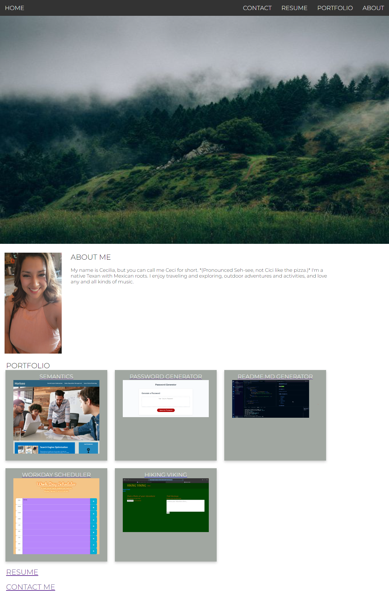

# Illuminate

# Professional README.md

## Description
This is my portfolio created as part of UT of Austin's full stack web-development course in showcasing my ability to create a website with a functioning UI.

## Table of Contents
* [Description](#description)
* [Installation](#installation)
* [Usage](#usage)
* [License](#license)
* [Credits](#credits)

## Installation
No installation instructions needed.

## Usage

## License
[License: MIT](https://opensource.org/licenses/MIT)

## Credits
https://www.w3schools.com/howto/

## Contact
The contact link on my page leads to a form to fill out and submit in order to contact me.